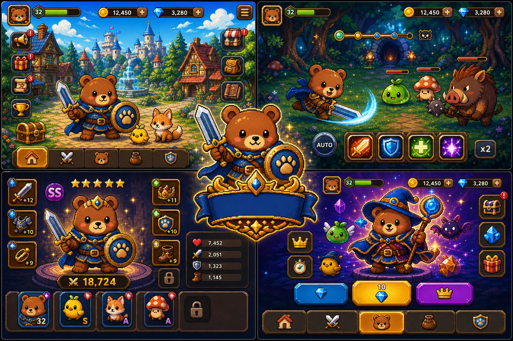
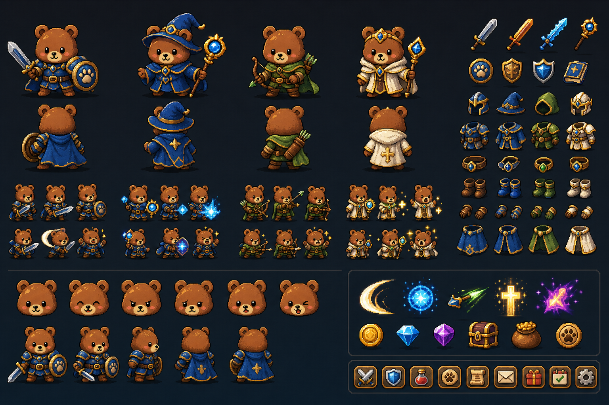
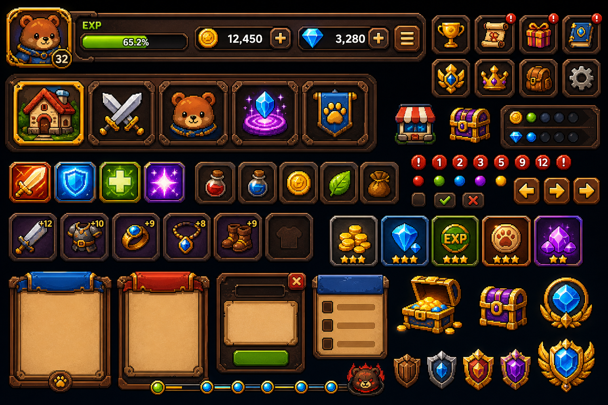

# 픽셀곰 RPG 모바일 게임 스타일 가이드 v1

작성일: 2026-05-28

## 1. 결론

픽셀곰 RPG 모바일 앱은 기존 카카오 운영봇의 `RPG 모험팩` 확장이 아닙니다.
앱이 본체이고, 카카오톡은 별도 `모바일 게임 전용 팩`으로 연동되는 보조 채널입니다.

핵심 방향은 다음과 같습니다.

| 구분 | 기준 |
| --- | --- |
| 게임 정체성 | 참여자용 모바일 픽셀 RPG |
| 기존 RPG 팩 관계 | 재사용하지 않음. 별도 게임으로 분리 |
| 카톡 연동 | 타이포게임/이벤트/보상/길드 활동을 앱 계정과 연결 |
| 앱 기준 | 마을, 모험, 스테이지, 전투, 성장, 수집, 소환, 길드 중심 |
| 디자인 기준 | 고밀도 픽셀 아트, 곰 영웅, 판타지 RPG, 모바일 수집형 UI |
| 장르 기준 | 세로형 자동전투 RPG를 중심으로 방치 보상과 수집 성장을 결합 |

## 2. 기준 이미지

아래 이미지는 Codex 이미지 생성으로 만든 v1 기준 소스입니다.
최종 게임 리소스가 아니라, 아트 방향과 UI 밀도를 맞추기 위한 스타일 기준입니다.

| 이미지 | 용도 |
| --- | --- |
|  | 마을, 전투, 캐릭터, 소환의 전체 분위기 |
|  | 픽곰 영웅, 직업, 장비, 표정, 포즈 기준 |
|  | HUD, 버튼, 장비 슬롯, 보상 카드, 팝업 기준 |

## 3. 아트 디렉션

| 항목 | 기준 |
| --- | --- |
| 전체 톤 | 밝고 풍부한 판타지, 귀여움과 전투감을 같이 유지 |
| 그래픽 | 고해상도 픽셀 아트처럼 보이는 2D 아트 |
| 선 처리 | 굵은 외곽선, 아이콘과 캐릭터 실루엣이 즉시 읽히는 형태 |
| 명암 | 금색 하이라이트, 깊은 남색 그림자, 보석/스킬 발광 효과 |
| 배경 | 마을은 밝고 밀도 있게, 전투 지역은 깊이감 있는 숲/던전 |
| UI 재질 | 어두운 목재 패널, 금속 테두리, 금색 베벨, 파란 보석 포인트 |
| 금지 | 기존 웹 서비스용 픽셀곰 자산 재사용, 평면 SaaS UI, 운영 콘솔 느낌 |

## 4. 캐릭터 기준

| 항목 | 기준 |
| --- | --- |
| 주인공 | 갈색 곰 `픽곰`, 큰 머리와 작은 몸의 SD 비율 |
| 기본 직업 | 전사, 마법사, 궁수, 힐러 |
| 대표 색 | 파란 망토/갑옷 + 금색 장식 |
| 장비 표현 | 무기, 방패, 투구, 갑옷, 장갑, 신발, 장신구가 외형에 반영 |
| 감정 | 기본, 기쁨, 공격, 피격, 승리, 당황, 졸림 |
| 확장 | 펫, 몬스터, 직업 스킨, 시즌 코스튬, 소환 영웅 |

## 5. UI 기준

| 컴포넌트 | 기준 |
| --- | --- |
| 상단 HUD | 아바타, 레벨, 경험치, 코인, 보석, 메뉴 |
| 하단 탭 | 마을, 모험, 캐릭터, 소환, 길드 |
| 버튼 | 둥근 사각형, 두꺼운 테두리, 금색/파란색 강조 |
| 알림 | 빨간 원형 배지, 숫자 또는 느낌표 |
| 재화 | 코인, 보석, 티켓, 행동력, 강화석 |
| 보상 카드 | 아이콘 중심, 별 등급, 수량, 발광 효과 |
| 팝업 | 목재/가죽 패널, 금속 테두리, 큰 확인 버튼 |
| 텍스트 | 실제 앱 구현 단계에서 코드로 렌더링. 생성 이미지 안의 글자는 기준으로 삼지 않음 |

## 6. 화면 범위

| 화면 | 목적 |
| --- | --- |
| 마을 | 앱 첫 진입, 캐릭터, 주요 메뉴, 이벤트 진입 |
| 모험 | 콘텐츠 선택 허브 |
| 스테이지 | 챕터, 난이도, 보스 진행도 |
| 전투 | 자동/수동 스킬, 몬스터, 보상 획득 |
| 방치 보상 | 오프라인 보상, 누적 재화, 빠른 수령 |
| 캐릭터 | 전투력, 레벨, 스탯, 외형 |
| 장비 | 장착, 교체, 등급, 세트 효과 |
| 강화 | 장비 강화, 승급, 재료 소모 |
| 스킬 | 스킬 장착, 성장, 쿨타임 |
| 펫 | 펫 수집, 동행, 보너스 |
| 몬스터 도감 | 발견 몬스터, 보상, 수집률 |
| 퀘스트 | 일일, 주간, 업적, 시즌 미션 |
| 출석 | 일자별 보상, 누적 출석 |
| 우편함 | 공지 보상, 쿠폰, 운영 보상 |
| 길드 | 길드 출석, 길드 보스, 길드 랭킹 |
| 랭킹 | 전투력, 스테이지, 타이포게임, 길드 |
| 소환 | 캐릭터, 펫, 장비, 이벤트 소환 |
| 상점 | 패키지, 재화, 성장 재료, 무료 상품 |
| 이벤트 | 시즌 던전, 타이포게임 이벤트, 한정 보상 |
| 설정 | 계정, 알림, 카톡 연동, 고객지원 |

## 7. 카카오톡 연동 기준

카카오톡 연동은 현재 존재하는 `RPG 모험팩`과 분리합니다.
새로운 모바일 게임 전용 팩을 개발하고, 앱 계정과 연결되는 보조 기능만 제공합니다.

| 영역 | 기준 |
| --- | --- |
| 연동 방식 | 앱에서 발급한 연동 코드를 카톡방/봇에 입력 |
| 주요 기능 | 타이포게임, 길드 출석, 쿠폰, 이벤트 미션, 랭킹 공유 |
| 보상 | 앱 내 재화, 행동력, 티켓, 장비 재료, 이벤트 포인트 |
| 제한 | 카톡 활동만으로 핵심 성장 밸런스를 무너뜨리지 않음 |
| 분리 원칙 | 기존 방별 RPG 팩 데이터, 장비, 가방, 포인트와 혼합하지 않음 |

후보 명령어는 별도 설계에서 확정합니다.

```text
/픽곰연동
/타이포게임
/타이포랭킹
/길드출석
/오늘보상
/쿠폰
/이벤트
```

## 8. MVP 기준

1차 MVP는 전체 기능을 모두 만들지 않고, 게임 정체성을 증명하는 화면과 루프에 집중합니다.

| 우선순위 | 포함 |
| --- | --- |
| 1 | 마을, 캐릭터, 장비, 스테이지, 전투 |
| 2 | 방치 보상, 퀘스트, 출석, 우편함 |
| 3 | 소환, 상점, 이벤트 |
| 4 | 펫, 몬스터 도감, 길드, 랭킹 |
| 5 | 카카오 타이포게임 연동 팩 |

## 9. 다음 산출물

| 단계 | 산출물 |
| --- | --- |
| 1 | 화면 IA와 하단 탭 구조 |
| 2 | MVP 기능 명세 |
| 3 | 캐릭터/몬스터/아이템 에셋 목록 |
| 4 | 카카오 모바일 게임 전용 팩 명령어 설계 |
| 5 | 앱 기술 구조와 데이터 모델 |

## 10. 열린 결정

| 결정 항목 | 선택 필요 |
| --- | --- |
| 앱 장르 세부 | 세로형 자동전투 RPG 중심. 방치 보상과 수집 성장은 보조 축 |
| 전투 방식 | 자동 전투 + 스킬/장비/펫 세팅 개입 |
| 수익화 | 광고, 패키지, 구독, 소환 재화 중 허용 범위 |
| 카톡 보상 강도 | 일일 보너스 수준인지, 핵심 성장 루프 일부인지 |
| 개발 우선 플랫폼 | Android 우선, iOS 동시, 웹뷰 기반 여부 |
